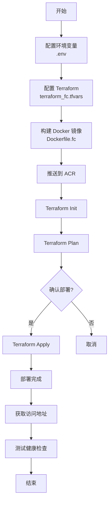

# 阿里云 Function Compute 部署文件说明

本目录包含部署 Web Backend API 到阿里云 Function Compute 所需的所有配置文件和脚本。

## 📁 文件结构

```
deployment/
├── Dockerfile.fc                      # FC 专用 Dockerfile（项目根目录）
├── terraform_fc.tf                    # Terraform 主配置文件
├── terraform_fc_variables.tf          # Terraform 变量定义
├── terraform_fc.tfvars.example        # Terraform 变量示例文件
├── .env.fc.example                    # 环境变量示例
├── deploy_fc.sh                       # 一键部署脚本（推荐）
├── build_and_push_image.sh            # 镜像构建推送脚本
├── FC_DEPLOYMENT_GUIDE.md             # 详细部署指南
└── README_FC.md                       # 本文件
```

## 🚀 快速开始

### 1. 准备配置文件

```bash
# 复制并编辑环境变量
cp .env.fc.example ../.env
vim ../.env  # 添加阿里云凭证和 ACR 配置

# 复制并编辑 Terraform 变量
cp terraform_fc.tfvars.example terraform_fc.tfvars
vim terraform_fc.tfvars  # 配置函数参数和环境变量
```

### 2. 执行部署

```bash
# 一键部署（推荐）
./deploy_fc.sh

# 或分步部署
./build_and_push_image.sh           # 构建并推送镜像
terraform init                       # 初始化 Terraform
terraform apply -var-file=terraform_fc.tfvars  # 部署函数
```

### 3. 验证部署

```bash
# 获取触发器 URL
TRIGGER_URL=$(terraform output -raw http_trigger_url)

# 测试健康检查
curl "${TRIGGER_URL}/health"
```

## 📋 文件说明

### Dockerfile.fc

**位置**: `/home/user/web_backend/Dockerfile.fc`

**用途**: FC 专用容器镜像构建文件

**主要特性**:
- 基于 Python 3.12-slim
- 使用 uv 包管理器
- 监听端口 9000（FC 默认）
- 单 worker 配置（FC 建议）
- 非 root 用户运行
- 包含健康检查

**构建命令**:
```bash
docker build -f Dockerfile.fc -t web-backend:latest --platform linux/amd64 .
```

---

### terraform_fc.tf

**用途**: Terraform 主配置文件，定义 FC 资源

**包含资源**:
- `alicloud_fc_service` - FC 服务
- `alicloud_fc3_function` - FC 函数（容器模式）
- `alicloud_fc3_trigger` - HTTP 触发器
- `alicloud_fc3_custom_domain` - 自定义域名（可选）
- `alicloud_fc3_provision_config` - 预留实例（可选）
- `alicloud_fc3_alias` - 版本别名（可选）

**使用方法**:
```bash
terraform plan -var-file=terraform_fc.tfvars
terraform apply -var-file=terraform_fc.tfvars
```

---

### terraform_fc_variables.tf

**用途**: 定义所有 Terraform 变量及其默认值

**主要变量分类**:
- 基础配置：region, access_key, secret_key
- 服务配置：service_name, function_name
- 容器配置：image, port, command
- 资源配置：memory, cpu, timeout
- 网络配置：VPC, 安全组
- 高级功能：预留实例, 灰度发布, 日志

---

### terraform_fc.tfvars.example

**用途**: Terraform 变量配置示例

**使用方法**:
```bash
cp terraform_fc.tfvars.example terraform_fc.tfvars
vim terraform_fc.tfvars  # 填写实际配置
```

**必填配置**:
- `alicloud_access_key` - 阿里云 Access Key
- `alicloud_secret_key` - 阿里云 Secret Key
- `container_image` - 容器镜像地址
- `environment_variables` - 应用环境变量

---

### .env.fc.example

**用途**: 部署脚本所需的环境变量示例

**使用方法**:
```bash
# 将内容追加到项目根目录的 .env 文件
cat .env.fc.example >> ../.env
vim ../.env  # 编辑配置
```

**必填变量**:
- `ALICLOUD_ACCESS_KEY` - 阿里云 Access Key
- `ALICLOUD_SECRET_KEY` - 阿里云 Secret Key
- `ACR_REGISTRY` - ACR 注册表地址
- `ACR_NAMESPACE` - ACR 命名空间

---

### deploy_fc.sh

**用途**: 一键部署脚本（推荐使用）

**功能**:
1. ✅ 检查配置文件和环境变量
2. ✅ 构建 Docker 镜像
3. ✅ 推送镜像到 ACR
4. ✅ 执行 Terraform 部署
5. ✅ 输出访问地址
6. ✅ 测试健康检查

**使用方法**:
```bash
# 完整部署
./deploy_fc.sh

# 跳过镜像构建（使用现有镜像）
./deploy_fc.sh --skip-build --skip-push

# 仅部署 Terraform
./deploy_fc.sh --skip-build --skip-push

# 销毁资源
./deploy_fc.sh --destroy

# 使用自定义变量文件
./deploy_fc.sh --var-file=custom.tfvars
```

**参数说明**:
- `--skip-build` - 跳过镜像构建
- `--skip-push` - 跳过镜像推送
- `--skip-deploy` - 跳过 Terraform 部署
- `--destroy` - 销毁 FC 资源
- `--var-file FILE` - 指定变量文件
- `--help` - 显示帮助信息

---

### build_and_push_image.sh

**用途**: 单独构建并推送容器镜像（不涉及 Terraform）

**使用场景**:
- 仅更新容器镜像
- CI/CD 流水线中的镜像构建步骤
- 测试镜像构建

**使用方法**:
```bash
./build_and_push_image.sh

# 使用自定义标签
IMAGE_TAG=v1.2.0 ./build_and_push_image.sh
```

---

### FC_DEPLOYMENT_GUIDE.md

**用途**: 详细部署指南（100+ 页）

**内容包括**:
- 📖 概述和架构说明
- 🔧 前置条件和环境准备
- 🚀 快速开始指南
- 📋 详细部署步骤
- ⚙️ 配置参数说明
- ❓ 常见问题解答
- 💡 最佳实践建议
- 🔍 故障排除指南
- 💰 成本估算示例

**适合人群**:
- 首次部署 FC 的用户
- 需要详细配置说明的用户
- 遇到问题需要排查的用户

---

## 🔄 部署流程图



---

## 📊 部署方式对比

| 特性 | ECS 部署 | FC 部署 |
|------|---------|---------|
| **成本** | 按月付费，固定成本 | 按量付费，弹性成本 |
| **运维** | 需要管理服务器 | 零运维 |
| **弹性** | 手动或定时扩缩容 | 自动弹性伸缩 |
| **冷启动** | 无 | 有（可通过预留实例避免） |
| **配置** | 需要配置 Nginx/负载均衡 | 内置 HTTP 触发器 |
| **适用场景** | 稳定流量，长期运行 | 流量波动，按需调用 |

---

## 🆚 当前部署方式

### 现有 ECS 部署（terraform.tf）

```hcl
# 使用启动模板创建 ECS
resource "alicloud_instance" "from_template" {
  launch_template_id = "lt-xxx"
}

# 自动更新 DNS
resource "null_resource" "dns_update" {
  # 执行 preview_dns.py
}
```

**特点**:
- ✅ 简单直接
- ✅ 无冷启动
- ❌ 固定成本
- ❌ 需要运维

### 新增 FC 部署（terraform_fc.tf）

```hcl
# 创建 FC 服务和函数
resource "alicloud_fc_service" "web_backend" { }
resource "alicloud_fc3_function" "web_api" { }
resource "alicloud_fc3_trigger" "http" { }
```

**特点**:
- ✅ 按量付费
- ✅ 自动伸缩
- ✅ 零运维
- ⚠️ 有冷启动（可优化）

---

## 🔐 安全注意事项

### 1. 环境变量管理

```bash
# ❌ 不要提交到版本控制
.env
terraform_fc.tfvars

# ✅ 使用 .gitignore
echo "terraform_fc.tfvars" >> .gitignore
echo ".env" >> .gitignore
```

### 2. 访问控制

```hcl
# 生产环境建议使用函数签名认证
http_auth_type = "function"

# 或配置自定义域名 + WAF
enable_custom_domain = true
enable_waf = true
```

### 3. 敏感信息加密

```hcl
# 使用 Terraform 变量标记为敏感
variable "jwt_secret" {
  type      = string
  sensitive = true
}

# 或使用阿里云 KMS
environment_variables = {
  DB_PASSWORD = "kms://encrypted-value"
}
```

---

## 📈 监控和告警

### 推荐监控指标

| 指标 | 告警阈值 | 说明 |
|------|---------|------|
| 错误率 | > 5% | 函数执行失败比例 |
| 超时次数 | > 10/分钟 | 函数执行超时 |
| 并发数 | > 80% | 接近并发上限 |
| 平均延迟 | > 1000ms | 响应时间过长 |
| 冷启动次数 | > 50/小时 | 冷启动频繁 |

### 配置告警（CloudMonitor）

```bash
# 登录阿里云控制台 -> 云监控 -> 报警规则
# 为 FC 服务配置以上指标的告警规则
```

---

## 🔗 相关资源

### 官方文档
- [阿里云 FC 产品文档](https://help.aliyun.com/product/50980.html)
- [Terraform Alicloud Provider](https://registry.terraform.io/providers/aliyun/alicloud/latest/docs/resources/fc3_function)
- [阿里云容器镜像服务](https://help.aliyun.com/product/60716.html)

### 工具链
- [uv - Python 包管理器](https://github.com/astral-sh/uv)
- [Docker - 容器引擎](https://docs.docker.com/)
- [Terraform - 基础设施即代码](https://www.terraform.io/)

### 项目文档
- [CLAUDE.md](../CLAUDE.md) - 项目总体说明
- [FC_DEPLOYMENT_GUIDE.md](./FC_DEPLOYMENT_GUIDE.md) - 详细部署指南

---

## ❓ 常见问题

### Q: ECS 和 FC 部署可以共存吗？

**A**: 可以。两种部署方式是独立的：
- ECS 部署：使用 `terraform.tf` 和 `deploy_ali_preview.sh`
- FC 部署：使用 `terraform_fc.tf` 和 `deploy_fc.sh`

可以根据场景选择合适的部署方式。

### Q: 如何在 ECS 和 FC 之间切换？

**A**: 部署到不同的域名或子域名：
- ECS: `preview.selfgo.asia`
- FC: `api-fc.selfgo.asia`

通过 DNS 切换流量。

### Q: 部署失败如何回滚？

**A**: 使用 Terraform 回滚：
```bash
# 回滚到上一个版本
terraform apply -var-file=terraform_fc.tfvars -target=alicloud_fc3_function.web_api

# 或完全销毁重新部署
./deploy_fc.sh --destroy
./deploy_fc.sh
```

---

## 📞 获取帮助

遇到问题时：

1. 📖 查看 [FC_DEPLOYMENT_GUIDE.md](./FC_DEPLOYMENT_GUIDE.md) 的故障排除部分
2. 🔍 查看 FC 控制台的调用日志
3. 🐛 提交 Issue 到项目仓库
4. 💬 联系技术支持

---

**创建日期**: 2025-11-14
**最后更新**: 2025-11-14
**维护者**: Claude Code
